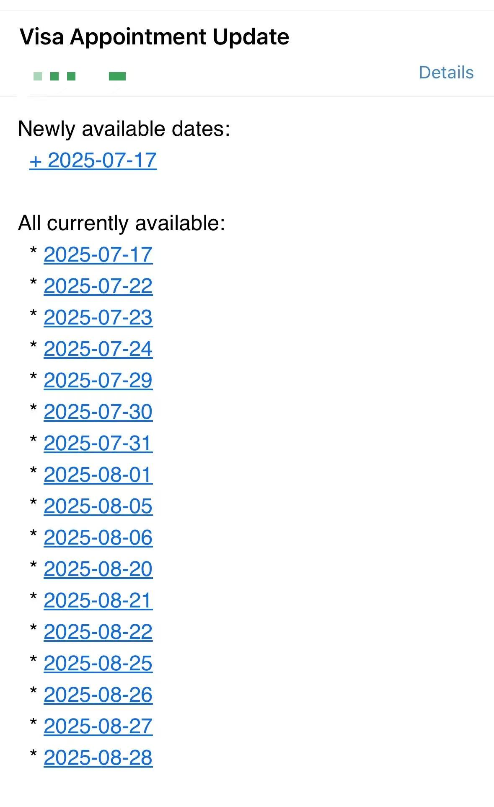

# 🇨🇳 美国签证预约监控工具

📖 查看英文版本: [English 🇺🇸](./README.md)

---

📅 **自动监控美国签证预约网站的可用日期，并通过邮件通知你！**  
💡 使用 Selenium + undetected_chromedriver 规避自动化检测  
✉️ 有新日期放出或消失时自动发送邮件提醒

---

## 🚀 最终效果


## ✨ 功能亮点

- ✅ 实时监控 [usvisascheduling.com](https://www.usvisascheduling.com)
- 📌 自动选择指定城市（默认：**武汉 WUHAN**）
- ⏱ 每 7 分钟检查一次更新
- ✉️ 邮件提醒预约变动
- 🧩 使用 `undetected_chromedriver` 降低被识别风险
- 🧪 支持手动登录（验证码等情况）

---

## 🚀 使用方法

### 1. 克隆项目

```bash
git clone https://github.com/yourname/visa-appointment-watcher.git
cd visa-appointment-watcher
```

### 2. 安装依赖

```bash
pip install -r requirements.txt
```

### 3. 配置邮箱信息

编辑 `sendmail()` 函数：

```python
SMTP_SERVER = "smtp.qq.com"
SMTP_PORT = 465  # Use 465 for SSL
EMAIL_SENDER = "xxx@qq.com"
EMAIL_PASSWORD = "xxx"
EMAIL_RECEIVER = "xxx@qq.com"
```

> 请确保已开启 SMTP 并使用 QQ 邮箱的 **授权码**
> 你也可以使用其他邮箱服务，记得调整 SMTP 设置

### 4. 启动脚本

```bash
python main.py
```

首次运行时请按提示：

- 手动登录账号
- 通过验证码验证
- 登录后按回车继续

> 你也可以使用 `nohup` 或任务调度工具（如 `tmux`）在后台运行
---

## 📬 邮件通知示例

```
Subject: Visa Appointment Update

Newly available dates:
  + 2025-07-14
  + 2025-07-20

Dates no longer available:
  - 2025-07-11

All currently available:
  * 2025-07-14
  * 2025-07-20
```

---

## ⚠️ 注意事项

- 本项目仅供学习交流，请勿用于商业用途
- 登录状态刷新后可能失效，建议运行时避免刷新页面
- 请保持网络稳定以避免中断

---

## 📄 License

[MIT License](./LICENSE)
